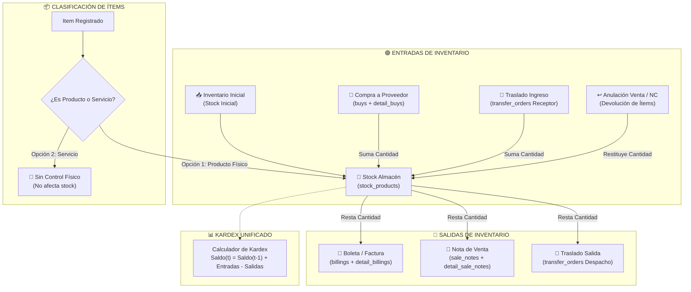
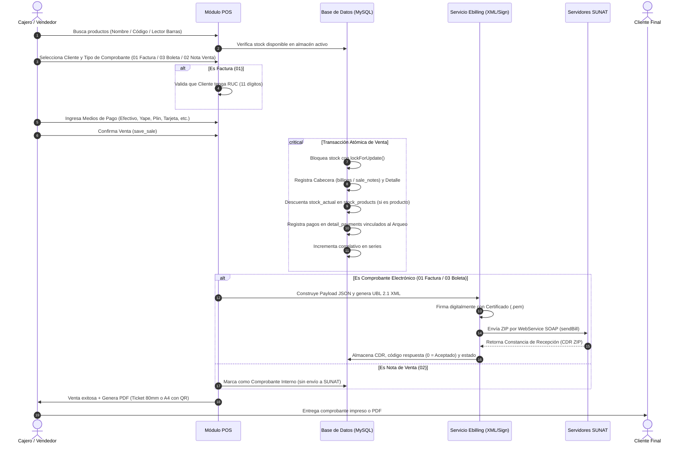
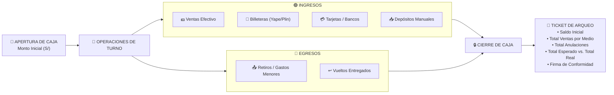
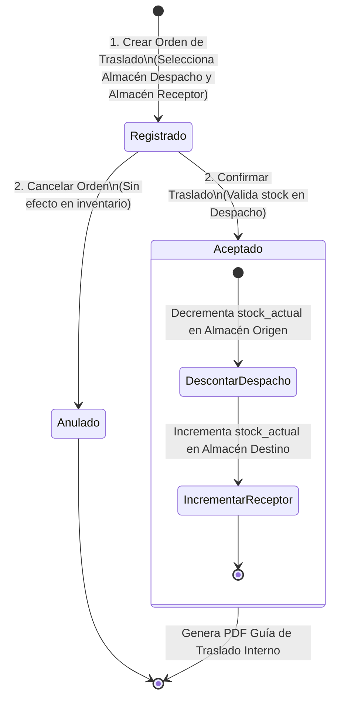
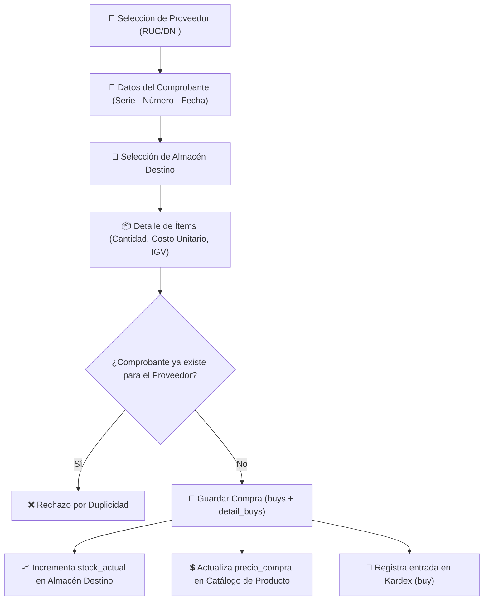

# SHIPIBO ERP - Sistema de Gestión Comercial y Facturación Electrónica SUNAT

> **MYTEMS E.I.R.L. | Perú**  
> Sistema integral de gestión comercial, control de inventarios multi-almacén, punto de venta (POS), arqueo de cajas, compras, cotizaciones y facturación electrónica UBL 2.1 conforme a la normativa SUNAT.

---

## Tabla de Contenidos

1. [Visión General del Sistema](#-visión-general-del-sistema)
2. [Arquitectura Tecnológica](#-arquitectura-tecnológica)
3. [Especificaciones de Producto (PRD)](#-especificaciones-de-producto-prd)
   - [3.1. Configuración de Empresa Emisora (`/business`)](#31-configuración-de-empresa-emisora-business)
   - [3.2. Catálogos Maestros y Parámetros SUNAT](#32-catálogos-maestros-y-parámetros-sunat)
   - [3.3. Clientes y Proveedores](#33-clientes-y-proveedores)
   - [3.4. Productos, Servicios y Multi-Almacén](#34-productos-servicios-y-multi-almacén)
   - [3.5. Compras y Abastecimiento](#35-compras-y-abastecimiento)
   - [3.6. Punto de Venta (POS)](#36-punto-de-venta-pos)
   - [3.7. Facturación Electrónica (CPE)](#37-facturación-electrónica-cpe)
   - [3.8. Notas de Venta (Comprobante Interno)](#38-notas-de-venta-comprobante-interno)
   - [3.9. Guías de Remisión Electrónica (GRE)](#39-guías-de-remisión-electrónica-gre)
   - [3.10. Traslados entre Almacenes](#310-traslados-entre-almacenes)
   - [3.11. Kardex Físico y Valorado](#311-kardex-físico-y-valorado)
   - [3.12. Arqueo y Control de Cajas](#312-arqueo-y-control-de-cajas)
   - [3.13. Cotizaciones y Proformas](#313-cotizaciones-y-proformas)
   - [3.14. Reportes y Analítica](#314-reportes-y-analítica)
   - [3.15. Contratos de Servicios con Firma Digital (`/contracts`)](#315-contratos-de-servicios-con-firma-digital-contracts)
   - [📄 Documento PDR Completo (`docs/PDR_SISTEMA_COMPLETO.md`)](docs/PDR_SISTEMA_COMPLETO.md)
4. [Flujos de Movimientos del Sistema](#-flujos-de-movimientos-del-sistema)
   - [4.1. Flujo de Movimientos de Inventario (Kardex)](#41-flujo-de-movimientos-de-inventario-kardex)
   - [4.2. Flujo de Ventas y Emisión de Comprobantes (POS / CPE)](#42-flujo-de-ventas-y-emisión-de-comprobantes-pos--cpe)
   - [4.3. Flujo de Caja y Medios de Pago (Arqueo)](#43-flujo-de-caja-y-medios-de-pago-arqueo)
   - [4.4. Flujo de Traslado entre Almacenes](#44-flujo-de-traslado-entre-almacenes)
   - [4.5. Flujo de Compras y Costeo](#45-flujo-de-compras-y-costeo)
5. [Estructura del Proyecto y Base de Datos](#-estructura-del-proyecto-y-base-de-datos)
6. [Instalación y Puesta en Marcha](#-instalación-y-puesta-en-marcha)
7. [Seguridad y Control de Accesos](#-seguridad-y-control-de-accesos)

---

## Visión General del Sistema

**Shipibo ERP** es una solución monolítica optimizada para empresas peruanas (On-Premise / Single-Tenant), diseñada para eliminar redundancias operativas, garantizar la consistencia tributaria ante la SUNAT y ofrecer un control en tiempo real de inventarios, finanzas de caja y facturación.

### Pilares del Sistema
* **Trazabilidad Total**: Cada movimiento físico o monetario cuenta con registro de usuario, caja, almacén, fecha/hora y documento de respaldo.
* **Separación Estricta Producto vs. Servicio**: Los productos descuentan/suman inventario por almacén; los servicios no afectan el stock físico pero cumplen la normativa fiscal.
* **Facturación Electrónica Nativa**: Generación y firma de XML UBL 2.1 en el backend con envío sincrónico/asincrónico a SUNAT y procesamiento de CDR.
* **Control Multi-Almacén y Multi-Caja**: Conmutador de establecimiento activo por usuario y series segregadas por caja.

---

## 🛠 Arquitectura Tecnológica

* **Backend**: PHP 8.2+ / Laravel 10.x
* **Base de Datos**: MySQL 8.0+ / MariaDB 10.4+
* **Frontend**: Blade Templates, Vanilla JS / ES6 Modules, Bootstrap 5.x, DataTables, SweetAlert2
* **Facturación Electrónica**:
  - Firma Digital XML-DSig (`.pem` / `.pfx`)
  - Generador UBL 2.1 XML (Facturas `01`, Boletas `03`, NC `07`, ND `08`, Guías `09`)
  - Cliente SOAP para WebServices SUNAT (Envío de comprobantes y consulta de CDR)
  - Cliente REST SUNAT para Guías de Remisión Electrónica (GRE)
* **Generación de Documentos**: DomPDF (Formatos Ticket 80mm y Hoja A4 con Código QR y Resumen Hash)
* **Control de Acceso**: Spatie Laravel-Permission (Roles y Permisos granulares)

---

## Especificaciones de Producto (PRD)

### 3.1. Configuración de Empresa Emisora (`/business`)
* **Datos Fiscales**: RUC, Razón Social (`MYTEMS E.I.R.L.`), Nombre Comercial, Dirección Fiscal, Ubigeo de 6 dígitos (Departamento, Provincia, Distrito), Teléfono, Correo.
* **Credenciales SUNAT**:
  - Usuario Secundario SOL y Clave SOL.
  - Certificado Digital (`.p12`/`.pfx` convertido a `.pem` con clave privada/pública).
  - Client ID y Client Secret para API REST Guías de Remisión (GRE).
  - Entorno de trabajo: Modo Pruebas (Beta) / Modo Producción.
* **Branding**: Logo corporativo para impresión de tickets térmicos (80mm) y formatos A4.

### 3.2. Catálogos Maestros y Parámetros SUNAT
* **Tipos de Comprobante (`type_documents`)**:
  - `01`: Factura Electrónica
  - `03`: Boleta de Venta Electrónica
  - `02`: Nota de Venta (Comprobante Interno)
  - `07`: Nota de Crédito Electrónica
  - `08`: Nota de Débito Electrónica
  - `09`: Guía de Remisión Remitente
* **Tipos de Documento de Identidad (`identity_document_types`)**:
  - `1`: DNI (8 dígitos)
  - `6`: RUC (11 dígitos)
  - `4`: Carnet de Extranjería
  - `7`: Pasaporte
  - `0`: Doc. Trib. No Domiciliado / Sin Documento
* **Tipos de Afectación al IGV (`igv_type_affections`)**:
  - `10`: Gravado - Operación Onerosa (18% IGV)
  - `20`: Exonerado - Operación Onerosa
  - `30`: Inafecto - Operación Onerosa
  - `40`: Exportación
* **Series y Correlativos (`series`)**:
  - Vinculadas al tipo de comprobante, caja asignada (`idcaja`) y almacén.
  - Prefijos estándar: `F001`, `B001`, `NV01`, `FC01`, `BC01`, `FD01`, `BD01`, `T001`.
  - Incremento atómico y seguro del número correlativo.

### 3.3. Clientes y Proveedores
* **Gestión Unificada**: Maestro centralizado con validación fiscal.
* **Consultas Automáticas**: Integración de consulta en línea DNI (RENIEC) y RUC (SUNAT) para auto-completado de razón social, estado, condición y dirección fiscal.
* **Validación de Facturación**: Regla obligatoria: Para emitir **Factura (`01`)**, el cliente debe contar con **RUC (`6`)** válido.
* **Proveedores**: Registro para compras con validación anti-duplicados por documento y gestión de contacto.

### 3.4. Productos, Servicios y Multi-Almacén
* **Tipos de Ítem (`opcion`)**:
  - `1 - Producto Físico`: Control estricto de inventario, stock actual, stock mínimo, costo de compra y precio de venta.
  - `2 - Servicio`: Ítem intangible, no controla inventario físico, no figura en reportes de stock pero se factura y calcula IGV.
* **Control Multi-Almacén (`stock_products`)**:
  - Cada producto posee un registro independiente de stock por almacén (`idalmacen`).
  - Alertas de stock mínimo.
  - Soporte de código de barras (EAN-13, Code128) y código interno.
  - Importación y exportación masiva vía Excel (.xlsx).

### 3.5. Compras y Abastecimiento
* **Ingreso de Mercadería**:
  - Registro de compras a proveedores formales asociando tipo de comprobante (Factura/Boleta de compra), serie y correlativo del proveedor.
  - Protección contra duplicidad de compras (`idproveedor` + `serie` + `correlativo`).
  - Selección de almacén de destino.
  - Actualización automática del stock en el almacén destino.
  - Actualización del último costo de compra (`precio_compra`) en el catálogo.

### 3.6. Punto de Venta (POS)
* **Experiencia de Venta Rápida**:
  - Búsqueda en tiempo real por descripción, código interno o lector de código de barras.
  - Selector de comprobante: Boleta (`03`), Factura (`01`), Nota de Venta (`02`).
  - Validación de stock en tiempo real antes de procesar el pago.
  - Condiciones de pago: **Contado** (múltiples métodos de pago simultáneos: Efectivo con cálculo de vuelto, Yape, Plin, Tarjeta, Transferencia) y **Crédito** (generación de cronograma de cuotas con fecha de vencimiento).
  - Aplicación de descuentos globales o por ítem.
  - Validación de caja abierta obligatoria para el usuario antes de procesar la venta.

### 3.7. Facturación Electrónica (CPE)
* **Ciclo de Vida del Comprobante**:
  1. `Generación de Payload y Totales`: Desglose de Gravada, Exonerada, Inafecta, IGV y Total.
  2. `Construcción XML UBL 2.1`: Estructura tributaria oficial SUNAT.
  3. `Firma Digital`: Aplicación del certificado digital mediante XML-DSig (`<ds:Signature>`).
  4. `Empaquetado y Envío`: Compresión ZIP y transmisión vía SOAP a los servidores de SUNAT.
  5. `Procesamiento de CDR`: Descompresión del archivo de respuesta (`R-*.zip`), extracción de código de respuesta (`0 = Aceptado`), notas y observaciones.
  6. `Estados del CPE`: Pendiente, Aceptado, Rechazado, Excepción (con opción de reintento).
* **Notas de Crédito (`07`) y Débito (`08`)**:
  - Anulación de factura/boleta o corrección por error en RUC/descripción/descuento.
  - Restitución automática de stock al almacén original en anulaciones totales (Catálogo 09 SUNAT tipo `01`).

### 3.8. Notas de Venta (Comprobante Interno)
* Comprobante administrativo para ventas que no requieren reporte inmediato a SUNAT.
* Utiliza serie interna (`NV01`), descuenta stock físico exactamente igual que una venta formal, genera registro en el arqueo de caja y permite impresión de ticket térmico.

### 3.9. Guías de Remisión Electrónica (GRE)
* Emisión de Guías de Remisión Remitente (`09`) bajo estándar SUNAT GRE API REST.
* Motivos de traslado: Venta, Traslado entre establecimientos de la misma empresa, Compra, Devolución, etc.
* Modalidades: Transporte Público (RUC de empresa de transportes) y Transporte Privado (Vehículo, Placa principal, Placa secundaria, Conductor, Licencia).
* Datos de partida y llegada con validación de UBIGEO y dirección fiscal.

### 3.10. Traslados entre Almacenes
* Órdenes de transferencia entre almacenes internos:
  - **Fase 0 (Registrado / En Tránsito)**: Orden creada con detalle de productos y cantidades.
  - **Fase 1 (Confirmado / Aceptado)**: Ejecución atómica que descuenta stock del almacén despachador y suma stock al almacén receptor.
  - **Fase 2 (Anulado)**: Cancelación de la orden sin impacto en inventario.
* Impresión de guía de transferencia interna en PDF.

### 3.11. Kardex Físico y Valorado
* Registro unificado de entradas y salidas ordenadas cronológicamente con cálculo de saldo continuo (*Running Balance*).
* Tipos de movimiento integrados:
  - `initial_stock`: Saldo / inventario inicial registrado.
  - `buy`: Entrada por compra a proveedor.
  - `transfer_in`: Entrada por traslado recibido.
  - `sale_note`: Salida por nota de venta.
  - `billing`: Salida por boleta o factura electrónica.
  - `transfer_out`: Salida por traslado despachado.

### 3.12. Arqueo y Control de Cajas
* **Apertura de Caja**: Registro de turno con monto base (`monto_inicial`), fecha, hora, usuario y almacén.
* **Operaciones durante el Turno**:
  - Ingresos por ventas de POS distribuidos por medio de pago (`detail_payments`).
  - Registro de depósitos manuales (entradas de dinero).
  - Registro de retiros manuales / gastos menores (salidas de dinero).
* **Cierre de Caja**:
  - Cálculo automático del monto esperado (`monto_inicial + ventas_efectivo + depositos - retiros`).
  - Conciliación de montos por billeteras digitales (Yape, Plin), tarjetas y transferencias.
  - Emisión de ticket de arqueo con resumen detallado y firma del cajero.

### 3.13. Cotizaciones y Proformas
* Emisión de proformas comerciales con selección de cliente, productos y servicios.
* Precios con cálculo de IGV y vigencia de oferta.
* **Conversión 1-Click a Venta**: Carga automática de la cotización en el carrito de compras del POS para concretar la venta sin re-digitar ítems.

### 3.14. Reportes y Analítica
* **Registro de Ventas**: Reporte fiscal exportable a PDF y Excel con desglose de Base Imponible, IGV, Exonerado, Inafecto y Total.
* **Ventas por Producto**: Cantidades e importes vendidos por período y almacén.
* **Ventas por Medio de Pago**: Totales recaudados en Efectivo, Billeteras Digitales, Tarjetas y Bancos.
* **Documentos Emitidos y Estado SUNAT**: Monitoreo de comprobantes con CDR recibido, pendientes o rechazados.

### 3.15. Contratos de Servicios con Firma Digital (`/contracts`)
* **Gestión Contractual Legal**: Creación, edición, consulta y anulación de contratos de prestación de servicios y eventos.
* **Comparecencia de Partes**: Registro formal de El Prestador (con datos de empresa emisora o representante) y El Cliente.
* **Especificación del Evento**: Fecha programada, horario de inicio y dirección/recinto del evento.
* **Cláusulas Dinámicas**: Editor dinámico de cláusulas legales con reordenamiento, adición, eliminación y carga de plantillas predefinidas.
* **Ítems y Precios**: Selección desde el catálogo o ingreso de servicios a medida con cálculo en vivo de subtotales, opción de IGV y total.
* **Firma Digital**: Captura directa en pantalla mediante Canvas táctil/mouse y opción alternativa de carga de imagen de firma.
* **Exportación en PDF A4**: Generación de contrato legal en formato A4 con logo, comparecientes, tabla de ítems, importe en letras (`NumeroALetras`), cláusulas y doble bloque de firma.

> [!TIP]
> Para consultar la especificación técnica completa y exhaustiva de todos los módulos, consulte el [PDR Oficial del Sistema Completo](docs/PDR_SISTEMA_COMPLETO.md).

---

## Flujos de Movimientos del Sistema

### 4.1. Flujo de Movimientos de Inventario (Kardex)



---

### 4.2. Flujo de Ventas y Emisión de Comprobantes (POS / CPE)



---

### 4.3. Flujo de Caja y Medios de Pago (Arqueo)



---

### 4.4. Flujo de Traslado entre Almacenes



---

### 4.5. Flujo de Compras y Costeo



---

## 🗄 Estructura del Proyecto y Base de Datos

### Directorios Principales
```text
├── app/
│   ├── Http/Controllers/
│   │   ├── Api/                    # Endpoints REST SUNAT (GRE, validaciones)
│   │   ├── ArchingCashController   # Control de aperturas, movimientos y cierres de caja
│   │   ├── BillingController       # Gestión de comprobantes electrónicos, NC, ND, XML y CDR
│   │   ├── BuyController           # Registro y control de compras a proveedores
│   │   ├── ClientController        # Clientes, validación fiscal y consulta RENIEC/SUNAT
│   │   ├── KardexController        # Kardex físico y valorado multi-almacén
│   │   ├── PosController           # Punto de venta, carrito, emisión rápida y cobros
│   │   ├── ProductController       # Catálogo de productos y servicios
│   │   ├── ProviderController      # Gestión de proveedores
│   │   ├── QuoteController         # Cotizaciones y conversión a venta
│   │   ├── SaleNoteController      # Notas de venta internas
│   │   ├── ShipmentGuideController # Guías de Remisión Electrónica (GRE)
│   │   ├── TransferOrderController # Traslados entre almacenes
│   │   └── WarehouseController     # Almacenes y gestión de stock
│   ├── Models/                     # Modelos Eloquent de base de datos
│   └── Services/
│       └── Ebilling/               # Motor de facturación electrónica UBL 2.1
│           ├── Cdr/                # Parser y extractor de CDR SUNAT
│           ├── Payload/            # Constructor de estructuras JSON/UBL
│           ├── Signing/            # Firmador digital XML-DSig
│           ├── Support/            # Rutas de almacenamiento y helpers
│           ├── Transport/          # Clientes SOAP y REST
│           ├── Validation/         # Validadores tributarios SUNAT
│           └── Xml/                # Renderizadores de XML UBL 2.1
├── database/
│   ├── migrations/                 # Migraciones de base de datos
│   └── seeders/                    # Semilleros (Ubigeo, Documentos, Catálogos)
├── resources/
│   └── views/                      # Vistas Blade del sistema
├── routes/
│   ├── web.php                     # Rutas web del sistema
│   └── api.php                     # Rutas API para SUNAT y servicios externos
└── public/
    └── files/                      # Certificados, XMLs, CDRs y PDFs generados
```

### Principales Tablas de Base de Datos
* `businesses`: Perfil de empresa emisora, credenciales SOL y certificado.
* `type_documents`: Tipos de comprobante de pago (01, 03, 02, 07, 08, 09).
* `identity_document_types`: Tipos de documento de identidad (DNI, RUC, CE, etc.).
* `igv_type_affections`: Catálogo 07 SUNAT de afectación al IGV (10, 20, 30, etc.).
* `warehouses`: Almacenes físicos y virtuales.
* `stock_products`: Inventario y costo por producto y almacén.
* `products`: Catálogo general (opcion 1 = Producto, 2 = Servicio).
* `clients`: Directorio de clientes y proveedores.
* `series`: Series y correlativos por comprobante y caja.
* `cashes` & `arching_cashes`: Cajas y registros de apertura/cierre de turnos.
* `billings` & `detail_billings`: Comprobantes electrónicos (Facturas, Boletas, NC, ND).
* `sale_notes` & `detail_sale_notes`: Notas de venta internas.
* `buys` & `detail_buys`: Registro de compras e ingreso de mercadería.
* `transfer_orders` & `detail_transfer_orders`: Traslados inter-almacén.
* `shipment_guides` & `shipment_guide_items`: Guías de remisión remitente (GRE).
* `quotes` & `detail_quotes`: Cotizaciones comerciales.
* `detail_payments`: Desglose de medios de pago por venta y arqueo.

---

## Instalación y Puesta en Marcha

### 1. Requisitos del Servidor
* PHP >= 8.2 con extensiones: `pdo_mysql`, `curl`, `soap`, `openssl`, `mbstring`, `zip`, `gd`, `xml`, `bcmath`.
* Servidor MySQL >= 8.0 o MariaDB >= 10.4
* Composer 2.x
* Node.js 18+ y NPM

### 2. Pasos de Instalación

```bash
# 1. Clonar el repositorio
git clone <url-del-repositorio>
cd shipibo

# 2. Instalar dependencias de PHP
composer install --optimize-autoloader --no-dev

# 3. Configurar archivo de entorno
cp .env.example .env
php artisan key:generate

# 4. Configurar base de datos en el archivo .env
# DB_CONNECTION=mysql
# DB_HOST=127.0.0.1
# DB_PORT=3306
# DB_DATABASE=shipibo_erp
# DB_USERNAME=tu_usuario
# DB_PASSWORD=tu_password

# 5. Ejecutar migraciones y semilleros
php artisan migrate --seed

# 6. Crear enlace simbólico de almacenamiento
php artisan storage:link

# 7. Compilar assets de frontend
npm install
npm run build

# 8. Iniciar el servidor local
php artisan serve
```

### 3. Configuración Inicial en el Sistema
1. Iniciar sesión con el usuario administrador.
2. Ingresar a **Configuración de Empresa (`/business`)**:
   - Completar Razón Social, RUC, Ubigeo y Dirección Fiscal.
   - Cargar Certificado Digital `.p12` o `.pem` con su contraseña.
   - Ingresar Usuario Secundario SOL y Clave SOL.
   - Subir el logo corporativo.
3. Ir a **Series (`/series`)** y verificar/crear las series para la caja correspondiente (`F001`, `B001`, `NV01`, `FC01`, `BC01`, `T001`).
4. Ir a **Arqueo de Caja (`/archingcash`)** y realizar la apertura de caja para el turno de venta.

---

## Seguridad y Control de Accesos

* **Autenticación**: Laravel Session Guard con protección CSRF en todos los formularios y llamadas AJAX.
* **Permisos Granulares**: Control de acceso por rol (`SUPERADMIN`, `ADMIN`, `VENDEDOR`, `ALMACENERO`) administrados mediante Spatie Permissions:
  - `admin.home`: Acceso al Dashboard principal.
  - `admin.pos`: Acceso a Punto de Venta.
  - `admin.billings`: Gestión de Comprobantes Electrónicos y Notas.
  - `admin.sale_notes`: Gestión de Notas de Venta.
  - `admin.buys`: Módulo de Compras.
  - `admin.transfer_orders`: Traslados de Almacén.
  - `admin.products`: Catálogo y Kardex.
  - `admin.warehouses`: Control de Almacenes y Stock.
  - `admin.arching_cashes`: Apertura y Cierre de Cajas.
  - `admin.business`: Configuración Fiscal del Emisor.
* **Integridad de Datos**: Transacciones atómicas con `DB::transaction()` y bloqueo de registros con `lockForUpdate()` para prevenir condiciones de carrera en inventario y correlativos.

---

<p align="center">
  <b>MYTEMS E.I.R.L. &bull; Sistema ERP & Facturación Electrónica</b><br>
  Desarrollado para máxima eficiencia operativa y cumplimiento fiscal SUNAT.
</p>
