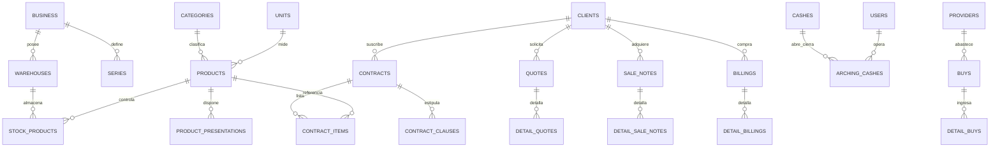
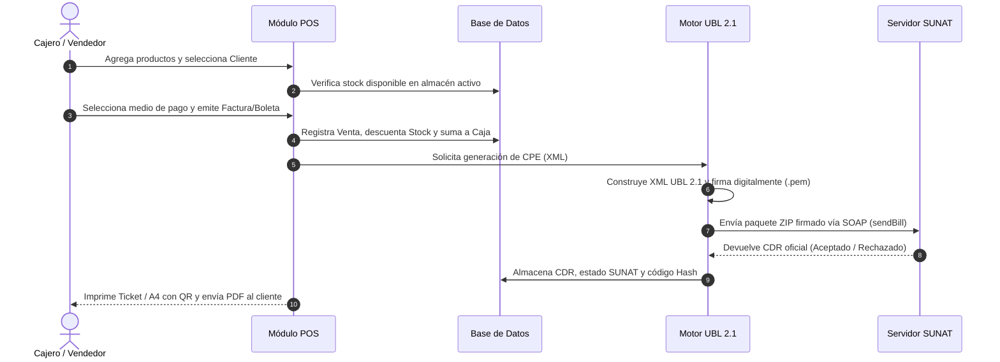
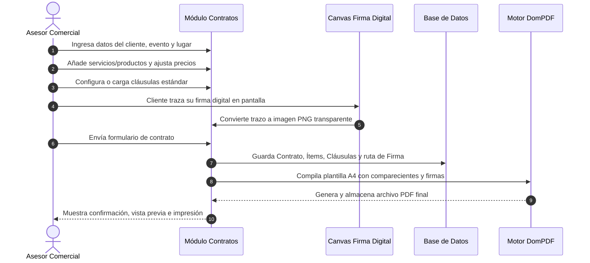

# PDR - Documento de Requerimientos y Diseño de Producto (Product Design & Requirements)
## Shipibo ERP: Sistema Integral de Gestión Comercial, Control Multi-Almacén y Facturación Electrónica SUNAT

---

## Control del Documento

| Campo | Detalle |
| :--- | :--- |
| **Proyecto** | Shipibo ERP (EasyStock) |
| **Emisor / Empresa Base** | MYTEMS E.I.R.L. (RUC 20601744158) / Configurable Multi-Empresa On-Premise |
| **Versión del Documento** | 2.5.0 |
| **Estado** | Aprobado / Producción |
| **Framework Base** | Laravel 10.x / PHP 8.2+ |
| **Base de Datos** | MySQL 8.0+ / MariaDB 10.4+ |
| **Normativa Tributaria** | SUNAT UBL 2.1 (Resolución de Superintendencia N° 097-2012/SUNAT y modificatorias) |
| **Última Actualización** | Septiembre 2026 |

---

## 1. Resumen Ejecutivo y Visión del Producto

### 1.1 Propósito
**Shipibo ERP** es una plataforma integral de gestión empresarial (ERP comercial) diseñada para pequeñas y medianas empresas peruanas. Centraliza en una arquitectura unificada el ciclo comercial completo: abastecimiento (compras), control físico y valorado de inventarios multi-almacén, ventas presenciales (POS táctil y código de barras), cotizaciones comerciales, contratos de prestación de servicios con firma digital, control de tesorería (cajas chicas, arqueos y cierre diario) y emisión directa de Comprobantes de Pago Electrónicos (CPE) y Guías de Remisión Electrónica (GRE) validados ante la SUNAT.

### 1.2 Objetivos Estratégicos
1. **Consistencia Tributaria SUNAT**: Emisión en tiempo real de Facturas (`01`), Boletas (`03`), Notas de Crédito (`07`), Notas de Débito (`08`) y Guías de Remisión Remitente (`09`) en estándar UBL 2.1 con firma digital XML-DSig y obtención inmediata de CDR (Constancia de Recepción).
2. **Trazabilidad Absoluta**: Registro granular de cada movimiento físico en almacén (Kardex) y monetario en caja (Arqueos) asociado al usuario, almacén activo, caja y documento fuente.
3. **Flexibilidad Comercial**: Coexistencia de notas de venta internas y comprobantes fiscales con unificación de stock y caja.
4. **Gestión Contractual Avanzada**: Generación de contratos legales para servicios/eventos con cláusulas dinámicas, cotización de ítems y captura de firma digital (canvas interactivo y carga de imagen) con exportación formal en PDF A4.
5. **Autonomía Operativa (On-Premise / Single-Tenant)**: Sin dependencia de APIs de terceros de pago para la facturación electrónica, ejecutando la firma digital y comunicación SOAP/REST directamente desde el servidor local.

---

## 2. Arquitectura de Software y Stack Tecnológico

```
┌──────────────────────────────────────────────────────────────────────────────────┐
│                             CAPA DE PRESENTACIÓN (UI)                            │
│  Blade Templates + Bootstrap 5.x + DataTables + Select2 + SweetAlert2 + Canvas   │
└────────────────────────────────────────┬─────────────────────────────────────────┘
                                         │ HTTP / AJAX / JSON
┌────────────────────────────────────────▼─────────────────────────────────────────┐
│                           CAPA DE APLICACIÓN (LARAVEL 10)                        │
│  ┌───────────────────────┐ ┌───────────────────────┐ ┌────────────────────────┐  │
│  │   Controladores MVC   │ │  Validaciones / Rules │ │  Middleware / Auth     │  │
│  │  (POS, CPE, Contratos)│ │  (RUC/DNI, Stock, IGV)│ │  (Spatie RBAC Permisos)│  │
│  └───────────┬───────────┘ └───────────┬───────────┘ └───────────┬────────────┘  │
│              │                         │                         │               │
│  ┌───────────▼─────────────────────────▼─────────────────────────▼────────────┐  │
│  │                           SERVICIOS ESPECIALIZADOS                         │  │
│  │  - Motor UBL 2.1 (Generador XML, Firma Digital XML-DSig, Cliente SOAP/REST)│  │
│  │  - Generador de Documentos DomPDF (Tickets 80mm y Hojas A4)                │  │
│  │  - Consulta RENIEC / SUNAT (API Factiliza / Consumo REST)                  │  │
│  │  - Gestor de Kardex e Inventario Multi-Almacén                             │  │
│  └─────────────────────────────────────┬──────────────────────────────────────┘  │
└────────────────────────────────────────┼─────────────────────────────────────────┘
                                         │ Eloquent ORM
┌────────────────────────────────────────▼─────────────────────────────────────────┐
│                               CAPA DE PERSISTENCIA                               │
│                   Base de Datos MySQL 8.0+ / MariaDB Transaccional                │
│       55+ Tablas Normalizadas (CPE, Clientes, Productos, Almacenes, Contratos)   │
└──────────────────────────────────────────────────────────────────────────────────┘
```

### 2.1 Componentes Técnicos
* **Lenguaje y Framework**: PHP 8.2+ con Laravel 10.50+.
* **Base de Datos**: MySQL 8.0 InnoDB con soporte estricto de transacciones ACID (`DB::transaction`) y claves foráneas con restricciones de integridad.
* **Seguridad y Permisos**: `spatie/laravel-permission` con segregación de roles (`SUPERADMIN`, `ADMIN`, `VENDEDOR`, `CAJERO`, `CONTABILIDAD`).
* **Motor PDF**: `barryvdh/laravel-dompdf` adaptado a tamaños térmicos de 80mm (`[0, 0, 226.77, variable]`) y formato estándar A4 portrait (`setPaper('A4', 'portrait')`).
* **Códigos QR y Barras**: `simplesoftwareio/simple-qrcode` y lectores ópticos mediante `onscan.min.js`.
* **Conversión Numérica**: `luecano/numero-a-letras` para expresión del importe total en letras según la normativa SUNAT.

---

## 3. Esquema Relacional de Base de Datos



---

## 4. Especificación Funcional de Módulos (Requerimientos)

### 4.1 Módulo de Configuración de Empresa (`/business`)
* **Propósito**: Administrar los datos fiscales del contribuyente emisor y las credenciales electrónicas.
* **Campos Requeridos**: RUC (11 dígitos), Razón Social, Nombre Comercial, Dirección Fiscal, Ubigeo de 6 dígitos, Departamento, Provincia, Distrito, Teléfono, Correo.
* **Credenciales SUNAT**:
  - Usuario Secundario SOL y Contraseña SOL (para SOAP de CPEs).
  - Certificado Digital (`.pfx` / `.pem` con clave privada).
  - Client ID y Client Secret para API REST Guías de Remisión Electrónica.
  - Modo de Operación: Pruebas (Beta) / Producción.
* **Branding**: Carga y redimensionamiento del logotipo oficial de la empresa para facturas, cotizaciones y contratos.

---

### 4.2 Módulo de Clientes y Proveedores (`/clients`, `/providers`)
* **Propósito**: Gestionar el directorio único de personas naturales y jurídicas con validación fiscal.
* **Tipos de Documento Homologados SUNAT**:
  - `1`: DNI (8 dígitos).
  - `6`: RUC (11 dígitos).
  - `4`: Carnet de Extranjería.
  - `7`: Pasaporte.
  - `0`: No Domiciliado / Sin Documento.
* **Consulta Rápida Automatizada**: Conexión al servicio de consulta para autocompletar Nombres / Razón Social y Dirección Fiscal a partir del número de DNI o RUC.
* **Normalización**: Soporte bidireccional de proveedores integrados en la estructura fiscal del cliente para evitar dispersión de tablas.

---

### 4.3 Módulo de Inventario, Productos y Multi-Almacén (`/products`, `/warehouses`, `/kardex`)
* **Separación Operativa Producto vs. Servicio**:
  - `opcion = 1` (Producto físico): Descuenta stock por almacén en cada venta, nota de venta o salida; suma stock en compras y recepciones de traslado.
  - `opcion = 2` (Servicio intangible): No gestiona stock físico ni kardex, pero cumple con las reglas tributarias de IGV y facturación.
* **Multi-Almacén**:
  - Cada almacén posee su tabla de existencias independiente (`stock_products`).
  - Conmutador de establecimiento activo en cabecera para restringir operaciones de venta al almacén donde se encuentra físicamente el usuario.
* **Presentaciones y Equivalencias**:
  - Soporte de múltiples presentaciones por producto (cajas, paquetes, unidades, docenas) con factor de conversión automático para descuento exacto en el kardex físico.
* **Kardex**:
  - Trazabilidad cronológica de entradas, salidas y saldos con vinculación al documento de origen (Venta, Compra, Traslado, Ajuste).

---

### 4.4 Módulo de Compras y Abastecimiento (`/buys`)
* **Propósito**: Registrar el ingreso de mercadería desde proveedores formales, afectando costos y stock.
* **Características**:
  - Registro de tipo de documento del proveedor (Factura, Boleta, Guía o Nota de Compra).
  - Selección de almacén de destino del inventario.
  - Ingreso de precio de compra pactado, actualizando el costo referencial del catálogo.
  - Incremento atómico en `stock_products` por transacción protegida.

---

### 4.5 Módulo de Cotizaciones y Proformas (`/quotes`)
* **Propósito**: Emitir propuestas comerciales formales sin descuento de stock ni afectación contable inmediata.
* **Funcionalidades**:
  - Generación de proformas numeradas en formato A4 y Ticket con código QR.
  - Envío automático de proforma por correo electrónico al cliente.
  - Conversión en 1 clic: Permite transformar una cotización aprobada directamente en una Venta POS o Nota de Venta, trasladando todos los ítems sin reescritura.

---

### 4.6 Módulo de Contratos de Servicios con Firma Digital (`/contracts`)
* **Propósito**: Gestionar contratos comerciales formales de prestación de servicios, catering, eventos y suministros.
* **Estructura del Contrato**:
  - **Numeración Única**: Correlativo automático por año (ej. `CON-2026-0001`).
  - **Identificación de Partes**: Comparecencia formal de El Prestador (con datos de la empresa o representante) y El Cliente (datos fiscales, teléfono, correo y dirección).
  - **Datos del Evento / Prestación**: Fecha del evento, hora de inicio, lugar/recinto del evento y fecha de término.
  - **Detalle de Ítems y Precios**: Selección desde catálogo o ítems manuales, con cálculo en tiempo real de cantidad, precio unitario, subtotal, opción de IGV (18%) y total.
  - **Cláusulas Contractuales Dinámicas**:
    - Editor repetidor de cláusulas múltiples (`titulo` y `contenido`).
    - Carga en un clic de plantilla estándar (Partes, Objeto, Fecha/Lugar, Pago, Obligaciones, Cancelación/Penalidades, Jurisdicción).
    - Botones de reordenamiento vertical (subir/bajar) y eliminación.
  - **Captura de Firma Digital**:
    - Canvas interactivo táctil/mouse para trazado directo en pantalla de la firma del cliente.
    - Opción alternativa de carga de archivo de imagen de firma (PNG/JPG) con vista previa.
    - Almacenamiento seguro en disco y firma incrustada en el contrato.
  - **Exportación en PDF A4**:
    - Documento legal completo con logo, comparecientes, tabla de servicios, desglose financiero con importe en letras (`NumeroALetras`), cláusulas y doble bloque de firmas (Prestador con sello/firma y Cliente con firma digital y DNI/RUC).
  - **Modal de Vista Rápida**: Inspección de datos, cláusulas y firma sin abandonar la lista.

---

### 4.7 Módulo de Punto de Venta (POS) y Notas de Venta (`/pos`, `/salenotes`)
* **Punto de Venta Táctil y Código de Barras**:
  - Búsqueda instantánea de productos con teclado, selector visual por categorías o lector de código de barras (`onScan`).
  - Validación de stock en tiempo real: Impide ventas de productos con existencia insuficiente en el almacén activo.
  - Medios de Pago Múltiples: Efectivo, Tarjeta, Yape, Plin, Transferencia o Mixto.
  - Cálculo automático de vuelto en efectivo.
* **Emisión Dual**:
  - **Nota de Venta (`salenotes`)**: Comprobante de control interno sin validez tributaria ante SUNAT. Descuenta stock del almacén activo e ingresa dinero a la caja abierta.
  - **Comprobante Electrónico (CPE)**: Emisión fiscal (Boleta o Factura) con pase inmediato al motor de facturación electrónica.

---

### 4.8 Módulo de Facturación Electrónica SUNAT UBL 2.1 (`/billings`)
* **Tipos de CPE Emitidos**:
  - Factura Electrónica (`01`): Exige RUC válido en estado Habido/Activo y razón social.
  - Boleta de Venta Electrónica (`03`): Para consumidor final con DNI o sin documento (hasta S/ 700.00).
  - Nota de Crédito (`07`): Anulación de la operación, anulación por error en RUC, corrección de descripción, descuento global o devolución total/parcial.
  - Nota de Débito (`08`): Intereses por mora, penalidades o aumento de valor.
* **Proceso de Emisión**:
  1. Construcción del árbol XML según especificación UBL 2.1.
  2. Firma digital XML-DSig con el certificado digital de la empresa.
  3. Empaquetado en formato `.zip` y envío al WebService SOAP de SUNAT (`sendBill`).
  4. Procesamiento de la respuesta: Almacenamiento del archivo CDR (`R-*.zip`), extracción del código de respuesta (`0` = Aceptado) y descripción oficial.
  5. Cálculo del código Hash (DigestValue) e impresión del código QR oficial en el comprobante (formato Ticket 80mm o A4).
  6. Envío asincrónico por correo del XML y PDF al cliente.

---

### 4.9 Módulo de Guías de Remisión Electrónica (`/shipment-guides`)
* **Normativa**: SUNAT GRE Remitente mediante API REST Oficial (OAuth2 con Client ID y Client Secret).
* **Características**:
  - Motivos de traslado estándar (Venta, Compra, Traslado entre establecimientos, Emisores itinerantes, Devolución).
  - Modalidades de transporte: Privado (vehículo y conductor propio con licencia y placa) o Público (empresa de transportes con RUC y MTC).
  - Indicación de punto de partida y punto de llegada con sus respectivos códigos de ubigeo.
  - Generación de código QR y representación impresa en formato A4 y Ticket.

---

### 4.10 Módulo de Traslados entre Almacenes (`/transferorders`)
* **Propósito**: Controlar el tránsito físico de mercaderías entre almacenes de la misma empresa.
* **Ciclo de Vida**:
  - Creación de Orden de Traslado: Especifica almacén origen, almacén destino y cantidades.
  - Estado Pendiente / En Tránsito: Descuenta el stock del almacén origen.
  - Recepción / Confirmación: Valida la llegada de la mercadería y suma el stock en el almacén destino.
  - Vinculación con Guía de Remisión Remitente para amparar el traslado en carretera.

---

### 4.11 Módulo de Arqueo de Cajas y Cierre Diario (`/archingcash`, `/archingcash/cierre-diario`)
* **Apertura de Caja**: Registro del monto inicial de apertura (fondo fijo) por usuario y turno.
* **Movimientos en Turno**:
  - Ingresos automáticos provenientes de ventas en efectivo, tarjetas y billeteras digitales.
  - Registro de Depósitos o Ingresos manuales de efectivo.
  - Registro de Retiros o Gastos menores con sustento.
* **Arqueo y Cierre de Caja**:
  - Resumen en tiempo real del saldo esperado en sistema versus el saldo físico contado en caja.
  - Registro de diferencias (Sobrante / Faltante).
  - Impresión del Ticket de Cierre de Caja y liquidación diaria consolidada.

---

### 4.12 Módulo de Reportes y Analítica (`/reportes`)
* **Registro de Ventas e Ingresos**: Reporte tributario consolidado con exportación a PDF y Excel para el área contable.
* **Ventas por Producto y Categoría**: Análisis de rotación de ítems e identificación de productos estrella.
* **Reporte de Medios de Pago**: Desglose financiero por canal (Efectivo, Tarjetas, Yape, Plin, Transferencias bancarias).
* **Reporte de Comprobantes y Estados SUNAT**: Seguimiento de comprobantes aceptados, rechazados y notas de crédito asociadas.

---

## 5. Flujos Operativos del Sistema (Diagramas de Proceso)

### 5.1 Flujo de Venta y Facturación Electrónica SUNAT


### 5.2 Flujo de Gestión de Contratos de Servicios


---

## 6. Reglas de Negocio Críticas

1. **Invariabilidad del Stock por Servicios**: Todo ítem con `opcion = 2` está exento de validación y descuento de stock, sin importar el almacén seleccionado.
2. **Exclusividad de Caja Abierta**: Un cajero no puede registrar ventas POS ni notas de venta si no cuenta con una sesión de arqueo activa (`estado = 1`) en su almacén.
3. **Validación de Identidad Fiscal para Facturas**: Para la emisión de Facturas Electrónicas (`01`), el cliente debe registrarse obligatoriamente con Tipo de Documento RUC (`6`) de 11 dígitos numéricos. No se permite factura con DNI ni clientes genéricos.
4. **Anulaciones de Comprobantes**:
   - Comprobantes con menos de 72 horas pueden anularse mediante Nota de Crédito Electrónica tipo `01` (Anulación de la operación).
   - Las Notas de Venta internas solo pueden ser anuladas por usuarios con permiso explícito, reintegrando de inmediato el stock al almacén correspondiente.
5. **Autonumeración de Contratos**: La numeración de contratos responde al formato `CON-{AÑO}-{CORRELATIVO_4_DIGITOS}`, garantizando correlatividad anual estricta.

---

## 7. Requerimientos No Funcionales (NFR)

| Dimensión | Especificación y Criterio de Aceptación |
| :--- | :--- |
| **Rendimiento** | Tiempo de respuesta en creación de ventas POS < 1.2 segundos en red local; respuesta de timbrado y generación de PDF < 3.5 segundos sujeta a latencia de SUNAT. |
| **Disponibilidad** | Operatividad 24/7 en servidor local o VPS Linux con soporte de colas para contingencias de red hacia los WebServices de SUNAT. |
| **Seguridad** | Cifrado de contraseñas mediante algoritmo Bcrypt; control de acceso basado en roles (RBAC); protección CSRF en todos los formularios web y sanitización de consultas SQL vía PDO/Eloquent. |
| **Compatibilidad** | Frontend responsivo apto para monitores táctiles de punto de venta (1024x768 o superior), tablets y dispositivos móviles. |
| **Respaldo** | Script automatizado de exportación diaria de base de datos MySQL y almacenamiento persistente de archivos XML, CDRs, firmas digitales y PDFs en la carpeta `public/files/`. |

---

## 8. Matriz de Cumplimiento y Estado del Sistema

| Módulo / Característica | Estado | Controlador Principal | Vistas Asociadas |
| :--- | :---: | :--- | :--- |
| **Empresa y Configuración SUNAT** | Completo | `BusinessController` | `admin.business` |
| **Usuarios y Roles Spatie** | Completo | `UserController`, `RoleController` | `admin.users`, `admin.roles` |
| **Gestión de Clientes y Consulta RUC/DNI** | Completo | `ClientController` | `admin.clients` |
| **Proveedores y Abastecimiento** | Completo | `ProviderController`, `BuyController` | `admin.providers`, `admin.buys` |
| **Productos, Categorías y Almacenes** | Completo | `ProductController`, `WarehouseController` | `admin.products`, `admin.warehouses` |
| **Kardex y Control de Existencias** | Completo | `KardexController` | `admin.kardex` |
| **Cotizaciones y Proformas** | Completo | `QuoteController` | `admin.quotes` |
| **Contratos con Firma Digital y Cláusulas** | Completo | `ContractController` | `admin.contracts` |
| **Punto de Venta (POS)** | Completo | `PosController` | `admin.pos` |
| **Notas de Venta Internas** | Completo | `SaleNoteController` | `admin.sale_notes` |
| **Comprobantes Electrónicos CPE (UBL 2.1)** | Completo | `BillingController` | `admin.billings` |
| **Notas de Crédito y Débito Electrónicas** | Completo | `BillingController` | `admin.billings` |
| **Guías de Remisión Electrónica GRE** | Completo | `ShipmentGuideController` | `admin.shipment_guides` |
| **Órdenes de Traslado entre Almacenes** | Completo | `TransferOrderController` | `admin.transfer_orders` |
| **Arqueos de Caja y Cierre Diario** | Completo | `ArchingCashController`, `DailyCashClosingController` | `admin.arching_cashes`, `admin.daily_closing` |
| **Reportes de Ventas, Pagos e Impuestos** | Completo | `ReportSalesController`, `BillingReportController` | `admin.reports` |
